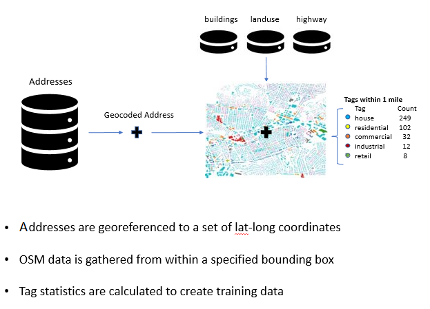

# OSM
Tools for working locally with OpenStreetMap (OSM) data

## Dependencies:

The file 'osm_batch.bat' requires [osmconvert](https://wiki.openstreetmap.org/wiki/Osmconvert#Download) to convert .PBF files to .OSM and [osmfilter](https://wiki.openstreetmap.org/wiki/Osmfilter#Download) to filter out specific tags or areas from larger files.

Python libraries for working with OSM and spatial data:

[shapely](https://shapely.readthedocs.io/en/latest/)

[geopandas](http://geopandas.org/install.html)

geojson

[osmnx](https://osmnx.readthedocs.io/en/stable/)

[ogr](https://gdal.org/python/)

## Pipeline:
Step 1 -> geofabrik.py -> download regional OpenStreetMap data for US from [Geofabrik](geofabrik.de)

Step 2 -> osm_batch.bat -> convert files and extract relevant data by tag

Step 3 -> osmtojson.py -> convert files to json format for analysis

Step 4 -> osm_feature_collection.py -> collect address-level OSM statistics

